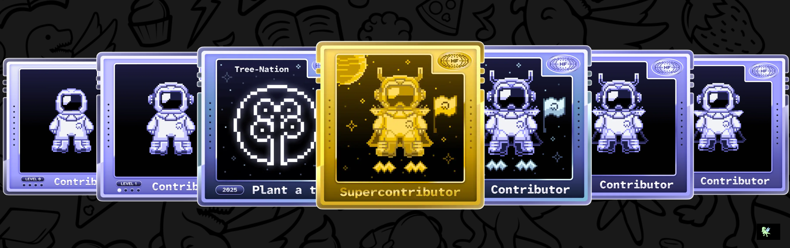

<h1 align="center">
  <strong>👾 Hey, I'm Rahul Gupta 👾</strong>
</h1>

  

## 💫 About Me

CS Undergrad at Delhi University with a passion for building scalable, user-centric applications. Proficient in modern web technologies, data structures & algorithms, and creating intuitive interfaces. Experienced in full-stack development, problem-solving, and open-source contributions. Always learning, always building.

## 🌐 Connect with Me

  
  
  

## 🚀 Featured Projects

### 🔹 Skillex
> AI-powered skill development platform for personalized learning paths.  
Stack: `TypeScript` • `Next.js` • `TailwindCSS`

### 🔹 CampusCartel
> Secret campus marketplace – Buy, sell, or trade with AI-inspired vibes.  
Stack: `TypeScript` • `Next.js` • `TailwindCSS`

---

## 💻 Tech Stack

### **Programming Languages**

### **Web & Backend Technologies**

### **Developer Tools**

### **Other Skills**

## 🎓 Certifications & Badges

  
  
  
  
  
  
  
  
  

## 🏅 LeetCode Badge Showcase

  
  
  
  
  

  
  
  
  
  
  
  
  
  

  
  

## 📊 GitHub Contributions

  

## 🏆 GitHub Trophies

  

### ✍️ Random Dev Quote

---

⭐️ If you like what you see, don't forget to ⭐ my repos and say hi on social!
