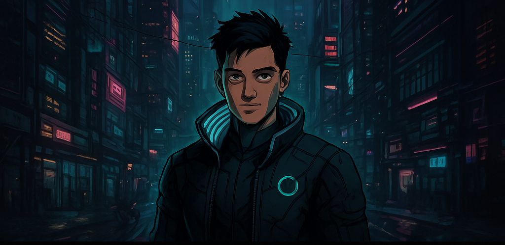

<!-- ==================== Cyberpunk Banner ==================== -->

  

<!-- ==================== Avatar & Title ==================== -->
<h1 align="center">
  👾 Hey, I'm Rahul Gupta 👾
</h1>
<h3 align="center">🚀 CS Undergrad @ Delhi University | Full-Stack Dev in Progress | Open-Source Builder</h3>

  

---

## 🧠 About Me
- 🎓 Pursuing B.Sc. (Hons) Computer Science @ **University of Delhi**  
- 🌱 Exploring modern web stacks: **React.js**, **Next.js**, **Express.js**, **MongoDB**, **TailwindCSS**, & **C++**  
- 💻 Passionate about crafting intuitive UIs, optimizing backend workflows, and clean code  
- 🌟 Aspiring open-source contributor—dreaming up tools that empower developers worldwide  

---

## 🚀 Featured Projects

  
  

### 🔹 FairSplit
> Smart Expense Splitter – Enter who paid what, assign items, and instantly see balances!  
Languages & Tools: `C++` • `CMake` • `Git` 

### 🔹 CampusCartel
> Secret campus marketplace – Buy, sell, or trade with AI-inspired vibes.  
Stack: `TypeScript` • `Next.js` • `TailwindCSS`

### 🔹 Zerodha Landing Page
> Responsive clone of Zerodha’s landing page. Perfect for sharpening UI skills.  
Built with: `HTML` • `CSS`

---

## 🛠 Tech Stack & Tools

  

---

## 🎮 Cyberpunk Level & Stats

   
  
  

---

## 📈 GitHub Metrics

    
  

  

---

## 🌐 Connect with Me

  
  
  

---

## 🔮 Future Goals
- 🚀 Launch an open-source UI component library  
- 🤖 Integrate AI-driven features into CampusCartel  
- 🎯 Contribute to 5+ major open-source projects by year-end  
- 🌐 Start a tech blog on full-stack tips & cyberpunk design hacks  

---

## 🎉 Fun Fact
> I turn ☕ into code, and bugs into features.  
Dorm + Dev = 🚀

---

⭐️ If you like what you see, don’t forget to ⭐ my repos and say hi on social!  
